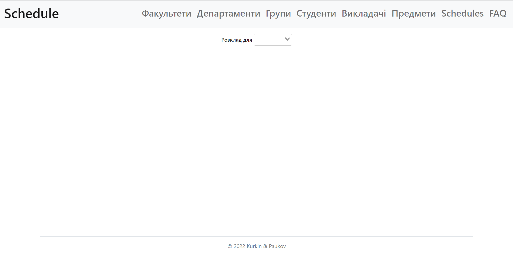
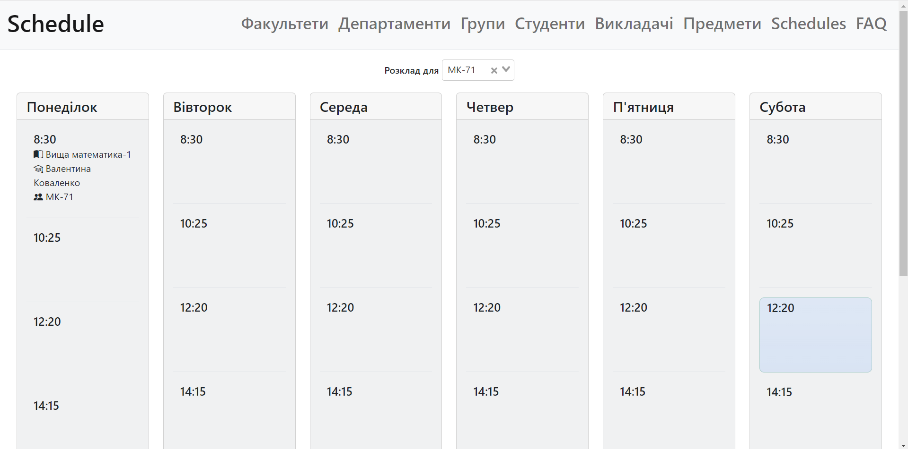
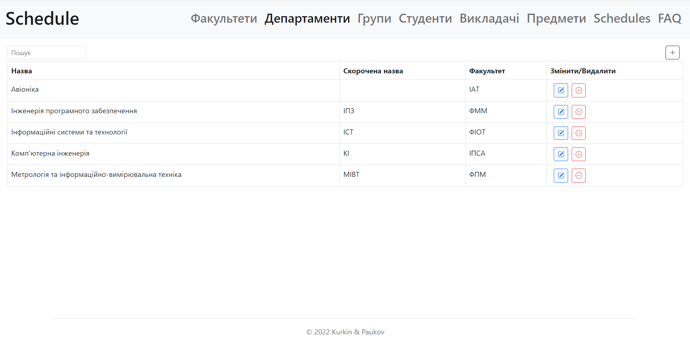

# Schedule
Front-end for university project 

### Description
The goal of the task was to develop schedule website in Ukrainian language with CRUD operations possible for **all** entities using web interface. 

### Website`s snapshots
<p align="center">

Default page
</p>
<hr>
<p align="center">

Schedule for a selected group
</p>
<hr>
<p align="center">

CRUD webpage for one of the entities
</p>


### Project Setup

```sh
npm install
```

#### Compile and Hot-Reload for Development

```sh
npm run dev
```

#### Compile and Minify for Production

```sh
npm run build
```
